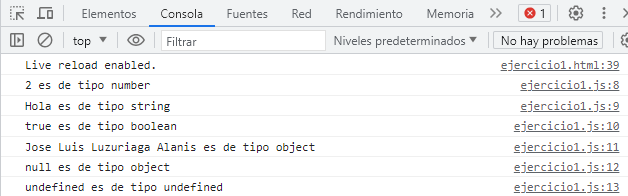
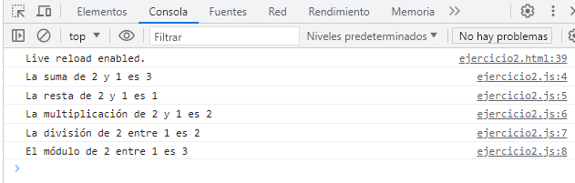
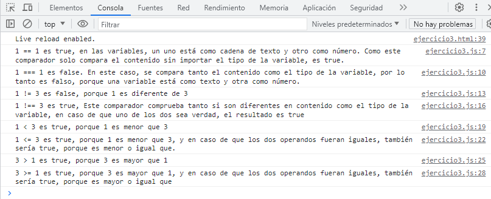
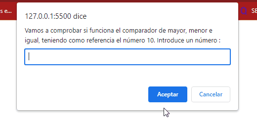
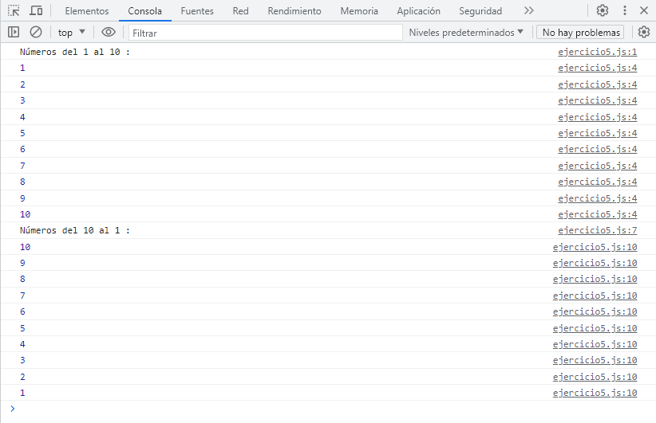

# 🔎 Análisis del problema

Hay que entregar una tarea que ha mandado el profesor a través de la plataforma classroom.

La tarea debe ser entregada el 5 de octubre de 2023.

Consta de 5 ejercicios y en cada uno de ellos hay varios apartados.

Estos ejercicios son para comenzar a aprender JavaScript.

# 📝 Diseño de la solución

Para entregar la tarea correctamente, habrá que seguir las indicaciones puestas al final de la misma, en el apartado **Formato de entrega**

Posteriormente habrá que leer cada apartado para saber lo que se pide y con ayuda de ChatGPT y mia, resolverlos.

# 💉  Implementación de la solución.

## EJERCICIO 1 : Declaración y Tipos de Datos

### ENUNCIADO

Objetivo: Familiarizarse con la declaración de variables y la identificación de tipos de datos.

Declara una variable para cada tipo de dato: Number, String, Boolean, Object, Null y Undefined.
Utiliza console.log para mostrar el valor y el tipo de cada variable.

### SOLUCIÓN

[**Archivo HTML** ](ejercicio1.html)

[**Archivo JS** ](recursos/scripts/ejercicio1.js)

## EJERCICIO 2 : Operaciones Aritméticas

### ENUNCIADO

Objetivo: Realizar operaciones aritméticas básicas.

Declara dos variables numéricas.
Realiza y muestra en la consola las operaciones de suma, resta, multiplicación, división y módulo entre estas variables.

### SOLUCIÓN

[**Archivo HTML** ](ejercicio2.html)

[**Archivo JS** ](recursos/scripts/ejercicio2.js)

## EJERCICIO 3 : Comparaciones

### ENUNCIADO

Objetivo: Comprender los operadores de comparación y cómo funcionan.

Declara tres variables con diferentes valores.
Utiliza operadores de comparación para comparar estas variables entre sí y muestra los resultados en la consola.

### SOLUCIÓN

[**Archivo HTML** ](ejercicio3.html)

[**Archivo JS** ](recursos/scripts/ejercicio3.js)

## EJERCICIO 4 : Estructuras Condicionales

### ENUNCIADO

Objetivo: Implementar estructuras condicionales para controlar el flujo del programa.

Escribir un programa que tome un número como entrada.

Si el número es mayor que 10, mostrar un mensaje indicando que es mayor. Si es menor, mostrar otro mensaje. Si es exactamente 10, mostrar un mensaje indicativo. (alert)

### SOLUCIÓN

[**Archivo HTML** ](ejercicio4.html)

[**Archivo JS** ](recursos/scripts/ejercicio4.js)

## EJERCICIO 5 : Bucles

### ENUNCIADO 

Objetivo: Implementar bucles para repetir acciones múltiples veces.

Escribir un bucle que muestre en la consola los números del 1 al 10.
Modificar el bucle anterior para mostrar solo los números pares entre 1 y 10.

### SOLUCIÓN

[**Archivo HTML** ](ejercicio5.html)

[**Archivo JS** ](recursos/scripts/ejercicio5.js)