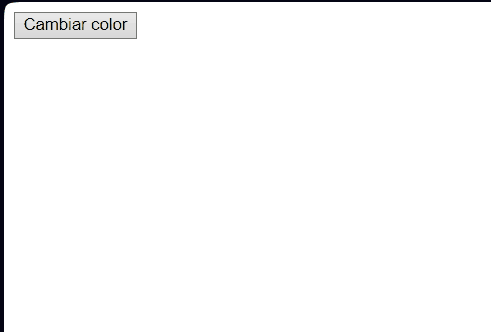
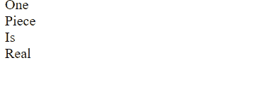

# 🔎 Análisis del problema

Hay que entregar una tarea que ha mandado el profesor a través de la plataforma classroom.

Estos ejercicios son para aprender JavaScript.

La tarea consta de los siguientes ejercicios :

``` 
Ejercicio 1: Cambio de Color con Botón

- Crear una página web que contenga un botón etiquetado "Cambiar color".

- Al hacer clic en el botón, el color de fondo de la página debe cambiar a un color aleatorio.

- Pista: Utiliza `Math.random()` para generar valores RGB aleatorios.
```

```
Ejercicio 2: Calculadora de Área

- Diseña una página web con dos campos de entrada (input) para introducir el ancho y el alto de un rectángulo.

- Agrega un botón etiquetado "Calcular Área".

- Al hacer clic en el botón, calcula el área del rectángulo y muestra el resultado en un elemento `<p>` en la página.

- Pista: Área del rectángulo = ancho x alto.
```

```
Ejercicio 3: Listado Dinámico

- Crea una página con un campo de entrada y un botón etiquetado "Añadir a la lista".

- También debes tener una lista vacía (`<ul>` o `<ol>`).

- Cuando el usuario escribe algo en el campo de entrada y hace clic en el botón, entonces el contenido del campo debe agregarse como un nuevo ítem (`<li>`) a la lista.

- Pista: Utiliza el método `.createElement()` y `.appendChild()` del DOM.
```

```
Ejercicio 4: Hover y Estilo Dinámico

- Diseña una página con varios elementos div, cada uno con un texto diferente.

- Al pasar el ratón sobre un div, cambia su color de fondo a azul y el texto a blanco.

- Al mover el ratón fuera del div, restaura sus estilos originales.

- Pista: Considera usar eventos como "mouseover" y "mouseout".
```

```
Ejercicio 5: Detección de Clics y Generación de XPath

Descripción:

Desarrolla una página web que, al hacer clic en cualquier elemento, muestre el XPath único de ese elemento en un cuadro de alerta o en una sección dedicada de la página.
Especificaciones:

1. Detección de Clics:

   - Añade un evento de escucha a todo el documento (`document`) para detectar cualquier clic realizado.

   - Al detectar un clic, determina el elemento exacto que fue clickeado usando el objeto `event.target`.

2. Generación de XPath:

   - Una vez identificado el elemento, genera su XPath.

  - Muestra el XPath generado en un cuadro de alerta o en una sección específica de la página.

Se adjunta el HTML para el ejercicio 5 llamado ‘Sprint2Ejercicio5.html’
``` 
Formato de entrega

Todos estos ejercicios se deberán entregar en el formato establecido en clase o tablón de classroom, respetando las horas de entrega de cada uno de ellos indicados en la tarea de classroom.

¿Qué y cómo se entrega?
Hay que realizar cada apartado de ejercicios en HTML diferentes y subirlo al repositorio a la carpeta SPRINT 2
Hay que realizar un vídeo en formato .gif para cada ejercicio en el que se interactúe de manera dinámica con la web y adjuntarlo en el README.md del repositorio GIT en la carpeta del sprint correspondiente.
Hay que realizar una captura de pantalla de aquellos ejercicios que sean estáticos y adjuntarlos en el README.md del repositorio GIT en la carpeta del sprint correspondiente.

# 📝 Diseño de la solución

Para entregar la tarea correctamente habrá que seguir el formato de entrega indicado en la misma. Posteriormente, habrá que leer cada apartado para saber lo que se pide y con ayuda de ChatGPT y mia, resolverlos.

# 💉  Implementación de la solución.

## EJERCICIO 1 : Declaración y Tipos de Datos

[**Archivo HTML** ](ejercicio1.html)

[**Archivo JS** ](recursos/scripts/ejercicio1.js)

## EJERCICIO 2 : Operaciones Aritméticas

[**Archivo HTML** ](ejercicio2.html)

[**Archivo JS** ](recursos/scripts/ejercicio2.js)

## EJERCICIO 3 : Comparaciones

[**Archivo HTML** ](ejercicio3.html)

[**Archivo JS** ](recursos/scripts/ejercicio3.js)

## EJERCICIO 4 : Estructuras Condicionales

[**Archivo HTML** ](ejercicio4.html)

[**Archivo JS** ](recursos/scripts/ejercicio4.js)

## EJERCICIO 5 : Bucles

[**Archivo HTML** ](Sprint2Ejercicio5.html)

[**Archivo JS** ](recursos/scripts/ejercicio5.js)

# 📸 Pruebas

## EJERCICIO 1 : Declaración y Tipos de Datos



## EJERCICIO 2 : Operaciones Aritméticas


## EJERCICIO 3 : Comparaciones


## EJERCICIO 4 : Estructuras Condicionales



## EJERCICIO 5 : Bucles

