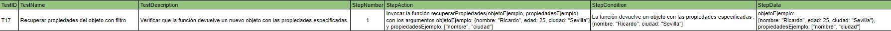
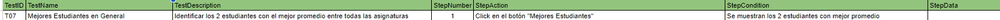

# 🔎 Análisis del problema

Hay que entregar una tarea que ha mandado el profesor a través de la plataforma classroom.

Estos ejercicios son para aprender JavaScript.

La tarea consta de los siguientes ejercicios :

``` 
Ejercicio 1: Filtrado de propiedades de un objeto

Dado un objeto y una lista de propiedades, escribe una función que devuelva un nuevo objeto solo con las propiedades indicadas.

function filtrarPropiedades(obj, propiedades) {
    // Tu código aquí
}

-----Ejemplo-----

Entrada:
var entrada = {a: 1, b: 2, c: 3, d: 4};
var props = ["a", "c"];

Salida: 
{a: 1, c: 3}

```

```
Ejercicio 2: Transposición de matrices

- Dada una matriz, escribe una función que devuelva la transposición de esa matriz.

function transponerMatriz(matriz) {
    // Tu código aquí
}

-----Ejemplo-----

Entrada:

var matriz = [
  [1, 2, 3],
  [4, 5, 6],
  [7, 8, 9]
];

Salida:
[
  [1, 4, 7],
  [2, 5, 8],
  [3, 6, 9]
]

```

```
Ejercicio 3: Fusión de objetos sin duplicados 

Dado dos objetos, escribe una función que los fusiona en uno solo. Si hay propiedades repetidas, conserva el valor del segundo objeto.

function fusionarObjetos(obj1, obj2) {
    // Tu código aquí
}

-----Ejemplo-----

Entrada:

PEPE = {a: 1, b: 2, c: 3, d: 4}
MANUEL = {b: 2, z: 3}

Salida:

PEPEMANUEL = {a: 1, b: 2, c: 3, d: 4, z: 3}
```

```
Ejercicio 4: Cadena más larga en un array

- Escribe una función que, dado un array de cadenas, devuelva la cadena más larga y su longitud.

function cadenaMasLarga(arr) {
    // Tu código aquí
}
```

```
Ejercicio 5: Ordenamiento interactivo de tabla de personas

Dada una tabla de personas con las columnas "Nombre", "Edad", "DNI", "Tiene/No tiene hijos" y "Fecha de nacimiento", escribe una función que permita ordenar la tabla por cualquiera de esas columnas. La columna "Fecha de nacimiento" debe tener el formato DD/MM/AAAA.

function ordenarTabla(personas, columna) {
    // Tu código aquí
}

-----Ejemplo de entrada-----

	var tabla = [
  {
    Nombre: "Ana",
    Edad: 25,
    DNI: "45678912B",
    "Tiene/No tiene hijos": "Tiene",
    "Fecha de nacimiento": "12/05/1998"
  },
  {
    Nombre: "Carlos",
    Edad: 30,
    DNI: "12345678A",
    "Tiene/No tiene hijos": "No tiene",
    "Fecha de nacimiento": "05/02/1993"
  },
  {
    Nombre: "Berta",
    Edad: 28,
    DNI: "98765432C",
    "Tiene/No tiene hijos": "Tiene",
    "Fecha de nacimiento": "20/03/1995"
  },
  {
    Nombre: "David",
    Edad: 31,
    DNI: "11223344D",
    "Tiene/No tiene hijos": "Tiene",
    "Fecha de nacimiento": "18/08/1992"
  }
];

Puntos a tener en cuenta:

Se debe generar la tabla en HTML a partir del array de ejemplo pero con 20 filas en total (hay que añadir 15 más al ejemplo)
Al hacer un primer click sobre la clave de la columna, por ejemplo, Nombre, las filas se ordenaran de manera descendente (Z-A).

Al hacer un segundo click sobre la clave de la columna, por ejemplo, Nombre, las filas se ordenaran de manera ascendente (A-Z).

Debe mantener la relación de las filas, es decir, no se ordena sólo la columna, sino la fila completa.
``` 
```
Ejercicio 6: Análisis y Transformación Avanzada de Datos
Descripción:

Dado un conjunto de datos en forma de array con información sobre estudiantes, sus calificaciones en diferentes asignaturas y detalles adicionales, implementa funciones para analizar, filtrar y transformar estos datos.

Parte 1: Estudiantes Destacados por Asignatura
Crea una función que, dada una asignatura, retorne los 3 estudiantes con las mejores notas en esa asignatura.

Parte 2: Asignatura con Menor Rendimiento
Diseña una función que identifique la asignatura en la que los estudiantes tienen, en promedio, la menor calificación.

Parte 3: Mejora de Notas para Estudiantes con Beca
Escribe una función que aumente todas las notas de los estudiantes con beca en un 10% (sin superar el máximo de 10).

Parte 4: Filtrado por Ciudad y Asignatura
Crea una función que, dada una ciudad y una asignatura, retorne la lista de estudiantes de esa ciudad ordenados descendentemente por la nota de la asignatura dada.

Parte 5: Estudiantes Sin Beca por Ciudad
Escribe una función que, dada una ciudad, retorne la cantidad de estudiantes que no tienen beca en esa ciudad.

Parte 6: Promedio de Edad de Estudiantes con Beca
Diseña una función que calcule el promedio de edad de los estudiantes que tienen beca.

Parte 7: Mejores Estudiantes en Total
Crea una función que devuelva un array con los 2 estudiantes que tengan el mayor promedio general entre todas las asignaturas.

Parte 8: Estudiantes con Todas las Materias Aprobadas

Diseña una función que retorne un array con los nombres de los estudiantes que hayan aprobado todas las materias (considera aprobado con una calificación mayor o igual a 5).

-----Ejemplo de entrada-----

const estudiantes = [
    { nombre: "Juan", ciudad: "Madrid", beca: false, edad: 21, calificaciones: { matematicas: 5, fisica: 7, historia: 6 } },
    { nombre: "Ana", ciudad: "Barcelona", beca: true, edad: 20, calificaciones: { matematicas: 9, fisica: 6, historia: 8 } },
    { nombre: "Pedro", ciudad: "Madrid", beca: false, edad: 23, calificaciones: { matematicas: 4, fisica: 5, historia: 7 } },
    { nombre: "Maria", ciudad: "Sevilla", beca: true, edad: 19, calificaciones: { matematicas: 8, fisica: 7, historia: 9 } },
    { nombre: "Jose", ciudad: "Madrid", beca: false, edad: 22, calificaciones: { matematicas: 6, fisica: 7, historia: 5 } },
    { nombre: "Isabel", ciudad: "Valencia", beca: true, edad: 20, calificaciones: { matematicas: 5, fisica: 8, historia: 7 } },
    { nombre: "David", ciudad: "Bilbao", beca: false, edad: 24, calificaciones: { matematicas: 7, fisica: 6, historia: 8 } },
    { nombre: "Laura", ciudad: "Barcelona", beca: true, edad: 19, calificaciones: { matematicas: 6, fisica: 8, historia: 7 } },
    { nombre: "Miguel", ciudad: "Sevilla", beca: false, edad: 21, calificaciones: { matematicas: 7, fisica: 7, historia: 8 } },
    { nombre: "Sara", ciudad: "Madrid", beca: true, edad: 20, calificaciones: { matematicas: 6, fisica: 5, historia: 9 } },
    { nombre: "Daniela", ciudad: "Valencia", beca: false, edad: 22, calificaciones: { matematicas: 8, fisica: 9, historia: 6 } },
    { nombre: "Alberto", ciudad: "Bilbao", beca: true, edad: 23, calificaciones: { matematicas: 5, fisica: 8, historia: 6 } },
    { nombre: "Gabriel", ciudad: "Sevilla", beca: false, edad: 19, calificaciones: { matematicas: 8, fisica: 5, historia: 7 } },
    { nombre: "Carmen", ciudad: "Barcelona", beca: true, edad: 24, calificaciones: { matematicas: 9, fisica: 9, historia: 9 } },
    { nombre: "Roberto", ciudad: "Madrid", beca: false, edad: 20, calificaciones: { matematicas: 4, fisica: 5, historia: 5 } },
    { nombre: "Carolina", ciudad: "Valencia", beca: true, edad: 22, calificaciones: { matematicas: 5, fisica: 7, historia: 6 } },
    { nombre: "Alejandro", ciudad: "Bilbao", beca: false, edad: 23, calificaciones: { matematicas: 9, fisica: 8, historia: 8 } },
    { nombre: "Lucia", ciudad: "Barcelona", beca: true, edad: 21, calificaciones: { matematicas: 7, fisica: 7, historia: 7 } },
    { nombre: "Ricardo", ciudad: "Sevilla", beca: false, edad: 19, calificaciones: { matematicas: 6, fisica: 5, historia: 6 } },
    { nombre: "Marina", ciudad: "Madrid", beca: true, edad: 20, calificaciones: { matematicas: 5, fisica: 9, historia: 8 } }
];

Funciones a Implementar:

function estudiantesDestacadosPorAsignatura(estudiantes, asignatura) {

    // Devuelve un array con los 3 estudiantes con las mejores notas en la asignatura dada
}

function asignaturaMenorRendimiento(estudiantes) {

    // Identifica la asignatura con el promedio de calificación más bajo
}

function mejoraNotasBeca(estudiantes) {

    // Aumenta todas las notas de los estudiantes con beca en un 10% (máximo 10)
}

function filtrarPorCiudadYAsignatura(estudiantes, ciudad, 
asignatura) {

    // Devuelve la lista de estudiantes de una ciudad ordenados descendentemente por la nota de la asignatura dada
}

function estudiantesSinBecaPorCiudad(estudiantes, ciudad) {
 
    // Devuelve la cantidad de estudiantes sin beca en la ciudad dada
}

function promedioEdadEstudiantesConBeca(estudiantes) {
    
    // Devuelve el promedio de edad de los estudiantes con beca
}

function mejoresEstudiantes(estudiantes) {
    
    // Devuelve un array con los 2 estudiantes con el mejor promedio general
}

function estudiantesAprobados(estudiantes) {
    
    // Devuelve un array con los nombres de los estudiantes que hayan aprobado todas las materias
}

Punto a destacar para la prueba:

Poned que las funciones se aplican cuando se pulsan botones diferentes, para que así podáis realizar una única prueba para probar cada una de las funciones en cada paso, es decir, paso 1, hacer click en el botón de la función “estudiantesDestacadosPorAsignatura()”, resultado esperado, lo que devuelve ese método y así sucesivamente con el resto de funciones.
``` 

Formato de entrega
Todos estos ejercicios se deberán entregar en el formato establecido en clase o tablón de classroom, respetando las horas de entrega de cada uno de ellos indicados en la tarea de classroom.

¿Qué y cómo se entrega?

- Hay que realizar cada apartado de ejercicios en HTML diferentes y subirlo al repositorio a la carpeta SPRINT 3.

- Hay que realizar un vídeo en formato .gif para cada ejercicio en el que se interactúe de manera dinámica con la web y adjuntarlo en el README.md del repositorio GIT en la carpeta del sprint correspondiente.

- Hay que realizar un plan de pruebas para aquellos ejercicios que sean dinámicos, es decir, de aquellos que se vayan a realizar .gif.

- Hay que realizar una captura de pantalla de aquellos ejercicios que sean estáticos y adjuntarlos en el README.md del repositorio GIT en la carpeta del sprint correspondiente.
Ejemplo de un README a continuación:


# 📝 Diseño de la solución

Para entregar la tarea correctamente habrá que seguir el formato de entrega indicado en la misma y leer cada apartado para saber lo que se pide. Una vez comprendidos los ejercicios, con ayuda de ChatGPT y mia, resolverlos.

# 💉  Implementación de la solución.

## Ejercicio 1: Filtrado de propiedades de un objeto

[**Archivo HTML** ](ejercicio1/ejercicio1.html)

[**Archivo JS** ](ejercicio1/ejercicio1.js)

## Ejercicio 2: Transposición de matrices

[**Archivo HTML** ](ejercicio2/ejercicio2.html)

[**Archivo JS** ](ejercicio2/ejercicio2.js)

##  Ejercicio 3: Fusión de objetos sin duplicados

[**Archivo HTML** ](ejercicio3/ejercicio3.html)

[**Archivo JS** ](ejercicio3/ejercicio3.js)

## Ejercicio 4: Cadena más larga en un array

[**Archivo HTML** ](ejercicio4/ejercicio4.html)

[**Archivo JS** ](ejercicio4/ejercicio4.js)

## Ejercicio 5: Ordenamiento interactivo de tabla de personas

[**Archivo HTML** ](ejercicio5/ejercicio5.html)

[**Archivo JS** ](ejercicio5/ejercicio5.js)

## Ejercicio 6: Análisis y Transformación Avanzada de Datos

[**Archivo HTML** ](ejercicio6/ejercicio6.html)

[**Archivo JS** ](ejercicio6/ejercicio6.js)

# 📸 Pruebas

## Ejercicio 1: Filtrado de propiedades de un objeto




## Ejercicio 2: Transposición de matrices


## Ejercicio 3: Fusión de objetos sin duplicados


## Ejercicio 4: Cadena más larga en un array


## Ejercicio 5: Ordenamiento interactivo de tabla de personas


## Ejercicio 6: Análisis y Transformación Avanzada de Datos





