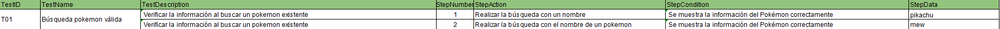
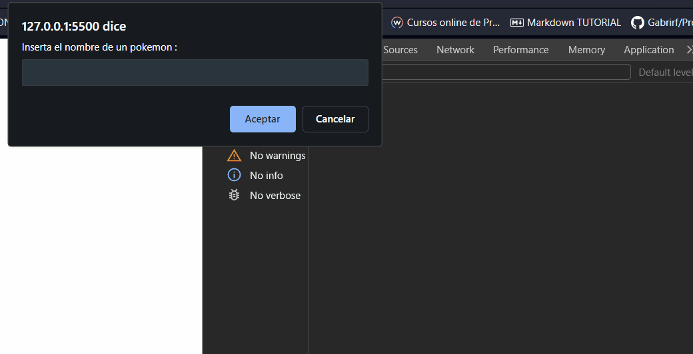
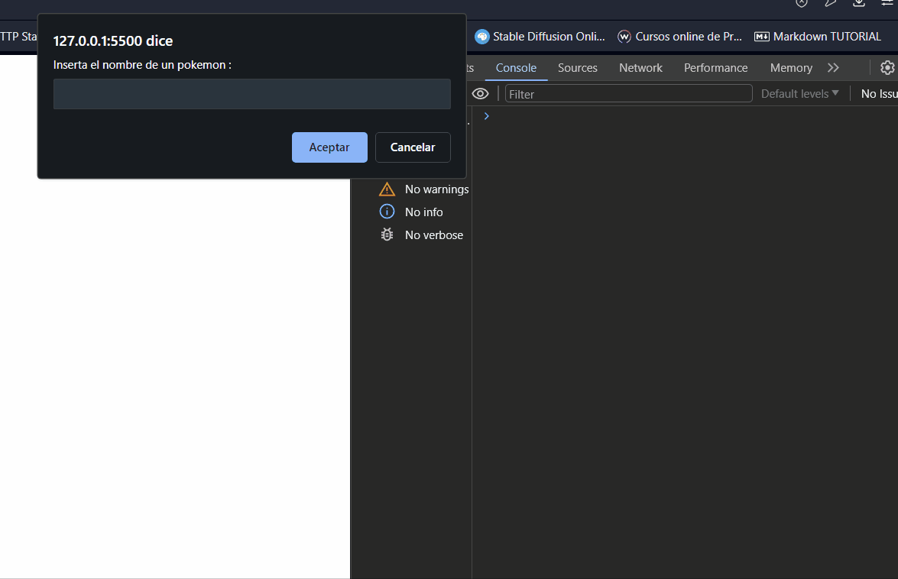
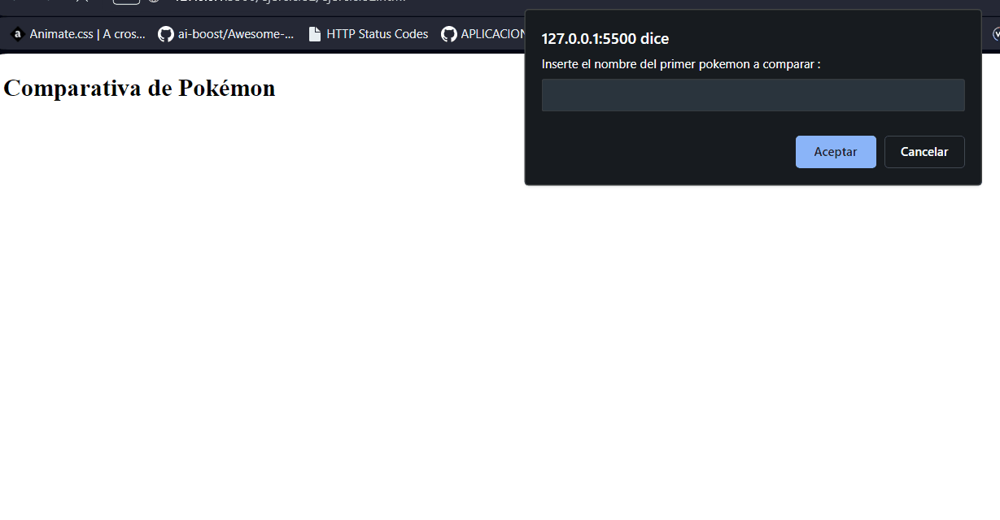
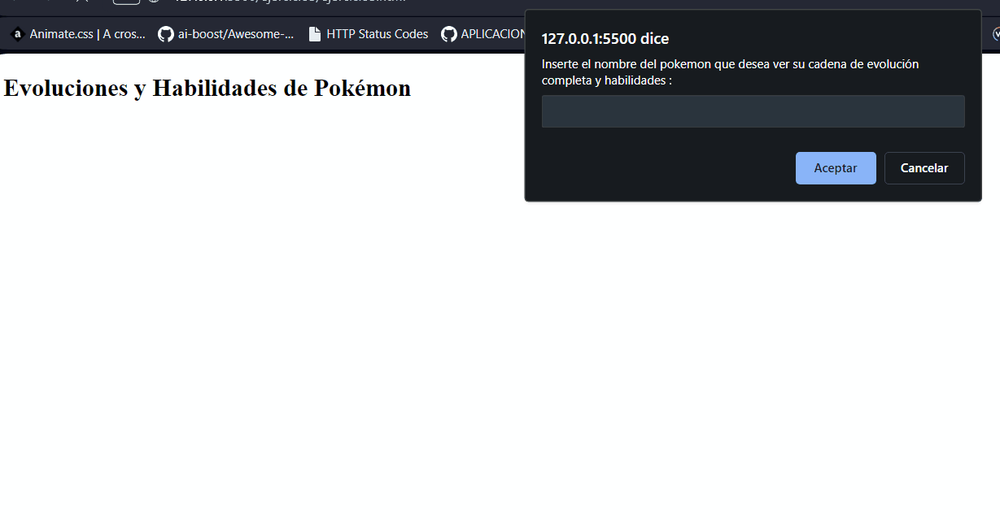
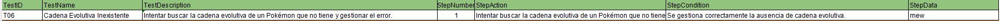
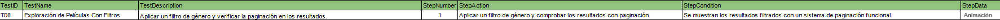
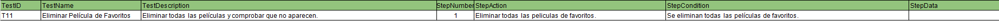

# 🔎 Análisis del problema

Hay que entregar una tarea que ha mandado el profesor a través de la plataforma classroom.

Estos ejercicios son para aprender JavaScript.

La tarea consta de los siguientes ejercicios :

``` 
Ejercicio 1: Información Básica del Pokémon

- Realizar una petición a la PokeAPI para obtener información básica de un Pokémon por su nombre.

- Mostrar el nombre, id, tipos, y una imagen del Pokémon.

- Gestionar errores de manera adecuada si el Pokémon no existe.

- Dos pruebas, una sin error probando dos búsquedas y otra con error.

```

```
Ejercicio 2: Comparativa de Pokémon

- Obtener datos de dos Pokémon elegidos por el usuario.

- Comparar sus estadísticas base (stats) y determinar cuál de ellos tiene mejores estadísticas generales.

- Presentar los resultados en una tabla comparativa de fácil lectura.

- Dos pruebas sin error.
```

```
Ejercicio 3: Evoluciones y Habilidades

- Dado un Pokémon específico, buscar su cadena de evolución completa.

- Listar cada una de las formas evolutivas y sus habilidades.

- Incluir un botón que permita al usuario ver más detalles de cualquier habilidad (usando un modal o una nueva vista).

- Dos pruebas, una con una cadena evolutiva y otra sin cadena evolutiva.
```

```
Ejercicio 4: Explorador de Películas

- Objetivo: Crear una aplicación web que permita a los usuarios explorar películas basándose en diferentes criterios como género. Usar la API The Movie DB (TMDB API)

- Interfaz de Búsqueda: Desarrollar una interfaz de usuario donde los usuarios puedan ingresar palabras clave o seleccionar filtros para buscar películas por género.

- Mostrar Resultados: Presentar los resultados de la búsqueda en un formato amigable para el usuario, mostrando detalles como el título de la película, año de lanzamiento, resumen y puntuación.

- Paginación de Resultados: Implementar la paginación para los resultados para que los usuarios puedan navegar a través de múltiples páginas de resultados.

- Dos pruebas, la primera, buscando una película, y en la segunda prueba, aplicar un filtro para que aparezca el reel relleno con paginación. (Estilo Netflix, Amazon Prime Video). Sólo un filtro a la vez.
``` 
```
Ejercicio 5: Películas favoritas

- Objetivo: Añadir al ejercicio 4 que se puedan añadir/eliminar las película a una lista de favoritos.

Tres pruebas:

- Prueba 1: Añadir 10 películas a favoritos dándole a la estrellita, comprobar que aparecen las 10 películas seleccionadas.

- Prueba 2: Eliminar la tercera y quinta película (comprobar que ya no aparecen)

- Pruebas 3: Eliminar todas las películas y comprobar que no aparecen.

``` 

Formato de entrega

Todos estos ejercicios se deberán entregar en el formato establecido en clase o tablón de classroom, respetando las horas de entrega de cada uno de ellos indicados en la tarea de classroom.

¿Qué y cómo se entrega?

Hay que realizar cada apartado de ejercicios en HTML diferentes y subirlo al repositorio a la carpeta SPRINT 4.

Hay que realizar un vídeo en formato .gif para cada ejercicio en el que se interactúe de manera dinámica con la web y adjuntarlo en el README.md del repositorio GIT en la carpeta del sprint correspondiente.

Hay que realizar una captura de pantalla de aquellos ejercicios que sean estáticos y adjuntarlos en el README.md del repositorio GIT en la carpeta del sprint correspondiente.

# 📝 Diseño de la solución

Para entregar la tarea correctamente habrá que seguir el formato de entrega indicado en la misma y leer cada apartado para saber lo que se pide. Una vez comprendidos los ejercicios, con ayuda de ChatGPT y mia, resolverlos.

# 💉  Implementación de la solución.

## Ejercicio 1: Información Básica del Pokémon

[**Archivo HTML** ](ejercicio1/ejercicio1.html)

[**Archivo JS** ](ejercicio1/ejercicio1.js)

## Ejercicio 2: Comparativa de Pokémon

[**Archivo HTML** ](ejercicio2/ejercicio2.html)

[**Archivo JS** ](ejercicio2/ejercicio2.js)

##  Ejercicio 3: Evoluciones y Habilidades

[**Archivo HTML** ](ejercicio3/ejercicio3.html)

[**Archivo JS** ](ejercicio3/ejercicio3.js)

## Ejercicio 4 y 5: Explorador de Películas y Películas favoritas

[**Archivo HTML** ](ejercicio4y5/ejercicio4.html)

[**Archivo JS** ](ejercicio4y5/ejercicio4.js)


# 📸 Pruebas

## Ejercicio 1: Información Básica del Pokémon









## Ejercicio 2: Comparativa de Pokémon





##  Ejercicio 3: Evoluciones y Habilidades







## Ejercicio 4 y 5: Explorador de Películas y Películas favoritas








