# 🔎 Análisis del problema

Hay que entregar una tarea que ha mandado el profesor a través de la plataforma classroom.

Estos ejercicios son para aprender JavaScript.

La tarea consta de los siguientes ejercicios :


```
Diferencias entre Java Script y TypeScript
```

1. Tipado Estático
   - Errores en Tiempo de Compilación: TypeScript proporciona errores y advertencias durante la fase de compilación, no en tiempo de ejecución. Esto ayuda a identificar problemas antes de que el código se ejecute.
   - Autocompletado y Refactorización: El tipado estático mejora la experiencia de desarrollo con funciones de autocompletado y herramientas de refactorización más robustas en los IDEs.

2. Mejor Soporte para Herramientas de Desarrollo
   - Integración con IDEs: TypeScript está bien integrado con entornos de desarrollo integrado (IDEs) como Visual Studio Code, proporcionando una mejor experiencia de desarrollo con características como resaltado de sintaxis, autocompletado, y navegación de código.
   - Herramientas de Análisis de Código: Facilita el uso de herramientas para analizar el código, lo que ayuda a mantener la calidad y consistencia del código.

3. **Mayor Legibilidad y Mantenibilidad del Código**
   - **Claridad en el Código**: El uso de tipos hace que el código sea más fácil de leer y entender, especialmente en proyectos grandes.
   - **Escalabilidad**: TypeScript es adecuado para proyectos grandes y complejos, ya que su estructura de tipado ayuda a gestionar y escalar el código de manera más eficiente.

4. **Orientación a Objetos Avanzada**
   - **Características de POO**: TypeScript ofrece características avanzadas de programación orientada a objetos, como clases, interfaces, y herencia, que no están presentes en JavaScript o son menos intuitivas de usar.

5. **Comunidad y Ecosistema**
   - **Adopción y Soporte**: TypeScript ha ganado una adopción significativa en la comunidad de desarrolladores. Muchas bibliotecas y frameworks populares ofrecen soporte y tipos para TypeScript.
   - **Documentación y Recursos**: Hay una amplia gama de documentación, tutoriales y recursos de aprendizaje disponibles para TypeScript.

``` 
Configurar el entorno para que en el directorio raiz del SPRINT 5 se transpilen los archivos typescript a javascript automaticamente
```
Para configurar el entorno de la manera indicada hay que seguir los siguientes pasos :

1. Buscar en la barra de busqueda del sistema, ```Windows Powershell```, una vez encontrado, hay que ejecutarlo como administrador e introducir en él, el comando ```Set-ExecutionPolicy RemoteSigned```. Después, introducir la vocal O, para dar un "Si a todo" y ya podremos cerrar el PowerShell.

2. Abrir el directorio SPRINT5 con Visual Studio.

3. Abrir la terminal en Visual Studio, y una vez abierta, tiene que aparecer la ruta de la raiz del proyecto SPRINT5. A continuación, introduciremos en esta terminal una serie de comandos que se indicarán en los siguientes pasos.

4. Iniciar un proyecto npm con valores de configuración por defecto introduciendo este comando ```npm init --y```

5. Instalar typescript solo para este proyecto introduciendo este comando ```npm install -D typescript```

6. Crear dos scripts en el archivo package.json para hacer uso del módulo tsc y guardar los cambios. Ejemplo del archivo package.json :

```
{
  "name": "sprint5",
  "version": "1.0.0",
  "description": "Descripción del proyecto",
  "main": "index.js",
  "devDependencies": {
    "typescript": "^5.3.3"
  },
  "scripts": {
    "test": "echo \"Error: no test specified\" && exit 1",
    "tsc": "tsc --init",
    "tscw" : "tsc -w"
  },
  "keywords": [],
  "author": "",
  "license": "ISC"
}
```

7. Ahora, ejecutaremos el script tsc, introduciendo el comando ```npm run tsc``` . Con este comando, crearemos un archivo esencial de configuración para la compilación de TypeScript, llamado tsconfig.json

8. Por último, ejecutaremos el script tscw para que los archivos .ts sean transpilados a .js automáticamente al guardar

```
Ejercicio 1: "Hola Mundo" en TypeScript

Objetivo: Crear un programa simple que imprima "Hola Mundo" en la consola.

Tareas:

Instalar TypeScript y configurar el entorno de desarrollo.
Crear un archivo holaMundo.ts.

Escribir una función que imprima "Hola Mundo".

Transpilar el archivo TypeScript a JavaScript y ejecutarlo.

Prueba: Hacer que ponga “Hola Mundo!”, ver que transpila e imprime “Hola Mundo!”. Quitar la exclamación “Hola Mundo”, ver que transpila e imprime “Hola Mundo”.

```

```
Ejercicio 2: Función con Tipos Básicos con Typescript

Objetivo: Escribir una función que acepte un nombre (string) y una edad (number) y devuelva un saludo personalizado.

Tareas:

- Crear una función saludar que tome dos parámetros: nombre y edad.

- La función debe retornar un saludo que incluya ambos datos.

- Probar la función con diferentes nombres y edades.

Prueba: Hacer que se pida introducir un nombre y una edad, tras esto, tendría que salir un texto que indique “Hola! mi nombre es {{nombre}} y tengo {{edad}} años”.

``` 

```
Ejercicio 3: Uso de Interfaces con Typescript

Objetivo: Crear una interfaz para un objeto "Usuario" y utilizarla para crear un usuario.

Tareas:

- Definir una interfaz Usuario con propiedades como nombre, edad y correo electrónico.

- Crear una función que acepte un objeto Usuario y devuelva una descripción del usuario.

- Crear varios objetos de prueba y pasarlos a la función.

Prueba: Instanciar un array de 5 Usuarios e imprimir por consola la frase “Hola! soy el usuario {{nombre}}, tengo {{edad}} años y mi correo electrónico es {{correo electrónico}}” para cada usuario.
``` 

```
Ejercicio 4: Manipulación de Arrays con Typescript

Objetivo: Crear una aplicación simple que maneje una lista de tareas (to-do list) usando arrays en TypeScript. Todo con una vista HTML.

Tareas:

Crear un array para almacenar tareas, cada una siendo un objeto con propiedades como id, titulo, y completada.

Implementar funciones para añadir, eliminar y marcar tareas como completadas.

Crear una función que muestre las tareas en la consola.

Prueba: Hay que realizar una prueba donde se realice lo mismo que en el vídeo:

- Añadir tarea a la lista de tareas
- Borrar tarea de la lista de tareas
- Añadir una tarea nueva a la lista
- Marcar esa tarea como “Importante”
- Ver que aparece en la lista de “Importante” y en la de tareas normal

``` 

```
Ejercicio 5: Crear una Pokedex con PokeAPI con Typescript

Objetivo: Construir una aplicación en TypeScript que utilice la PokeAPI para mostrar información de Pokémon.

Tareas:
Estudiar la documentación de la PokeAPI para entender cómo obtener datos de Pokémon.

Crear una interfaz de usuario interactiva utilizando HTML/CSS.

Implementar un campo de búsqueda donde los usuarios puedan escribir el nombre o ID de un Pokémon y obtener resultados en tiempo real.

Diseñar una visualización atractiva de la información del Pokémon, incluyendo imágenes, tipos, estadísticas básicas, movimientos, y evoluciones.

Manejar posibles errores, como búsquedas de Pokémon que no existen.
```

## Formato de entrega

Todos estos ejercicios se deberán entregar en el formato establecido en clase o tablón de classroom, respetando las horas de entrega de cada uno de ellos indicados en la tarea de classroom.

¿Qué y cómo se entrega?
Hay que realizar cada apartado de ejercicios en HTML diferentes y subirlo al repositorio a la carpeta SPRINT 5

Hay que realizar un vídeo en formato .gif para cada ejercicio en el que se interactúe de manera dinámica con la web y adjuntarlo en el README.md del repositorio GIT en la carpeta del sprint correspondiente.

Hay que realizar una captura de pantalla de aquellos ejercicios que sean estáticos y adjuntarlos en el README.md del repositorio GIT en la carpeta del sprint correspondiente.


# 📝 Diseño de la solución

Para entregar la tarea correctamente habrá que seguir el formato de entrega indicado en la misma y leer cada apartado para saber lo que se pide. Una vez comprendidos los ejercicios, con ayuda de ChatGPT y mia, resolverlos.

# 💉  Implementación de la solución.

## Ejercicio 1: "Hola Mundo" en TypeScript


[**Archivo HTML** ](ejercicio1/ejercicio1.html)

[**Archivo JS** ](ejercicio1/ejercicio1.js)

[**Archivo TS** ](ejercicio1/ejercicio1.ts)

## Ejercicio 2: Función con Tipos Básicos con Typescript

[**Archivo HTML** ](ejercicio2/ejercicio2.html)

[**Archivo JS** ](ejercicio2/ejercicio2.js)

[**Archivo TS** ](ejercicio2/ejercicio2.ts)

##  Ejercicio 3 : Uso de Interfaces con Typescript 

[**Archivo HTML** ](ejercicio3/ejercicio3.html)

[**Archivo JS** ](ejercicio3/ejercicio3.js)

[**Archivo TS** ](ejercicio3/ejercicio3.ts)

[**Archivo CSS** ](ejercicio3/estilos.css)

## Ejercicio 4 : Manipulación de Arrays con Typescript

[**Archivo HTML** ](ejercicio4/ejercicio4.html)

[**Archivo JS** ](ejercicio4/ejercicio4.js)

[**Archivo TS** ](ejercicio4/ejercicio4.ts)

[**Archivo CSS** ](ejercicio4/estilos.css)

## Ejercicio 5 : Crear una Pokedex con PokeAPI con Typescript

[**Archivo HTML** ](ejercicio5/ejercicio5.html)

[**Archivo JS** ](ejercicio5/ejercicio5.js)

[**Archivo TS** ](ejercicio5/ejercicio5.ts)

[**Archivo CSS** ](ejercicio5/estilos.css)

# 📸 Pruebas

## Ejercicio 1 : "Hola Mundo" en TypeScript

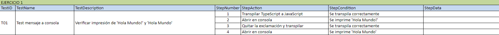

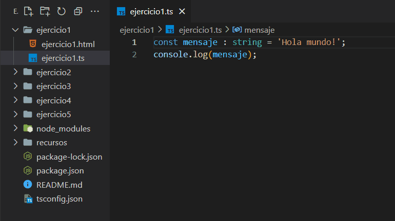

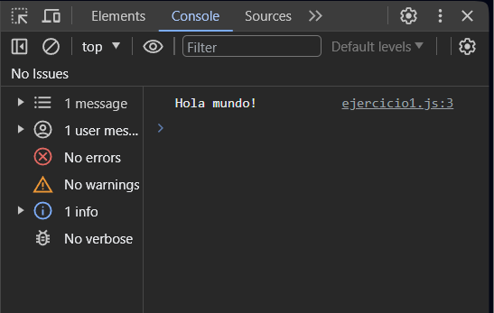

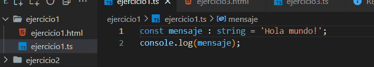

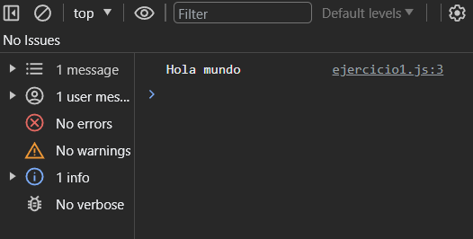

## Ejercicio 2 : Función con Tipos Básicos con Typescript

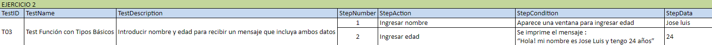

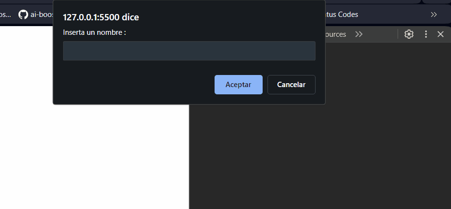


##  Ejercicio 3 : Uso de Interfaces con Typescript 

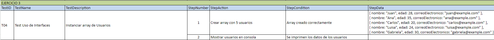

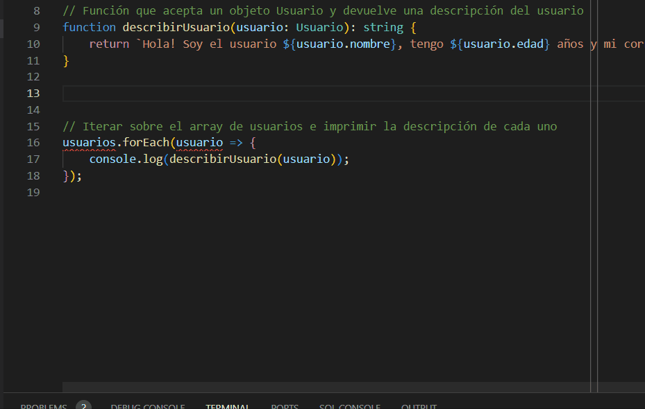

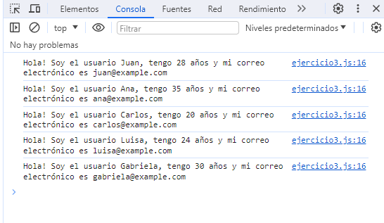

## Ejercicio 4 : Manipulación de Arrays con Typescript

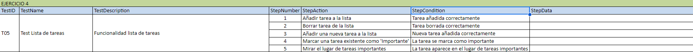

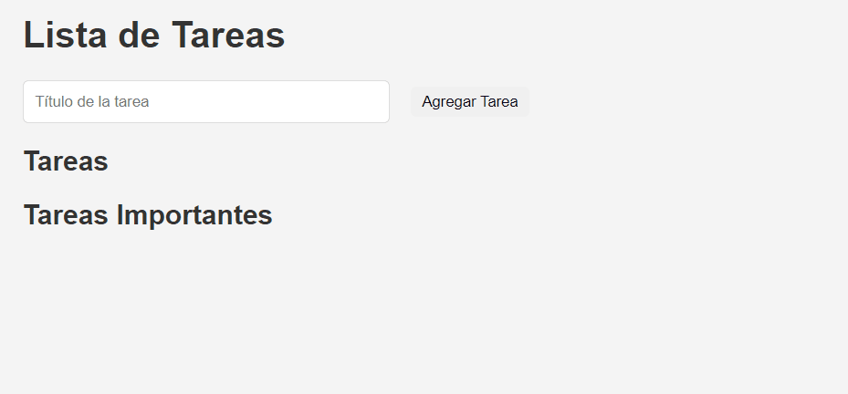

## Ejercicio 5 : Crear una Pokedex con PokeAPI con Typescript

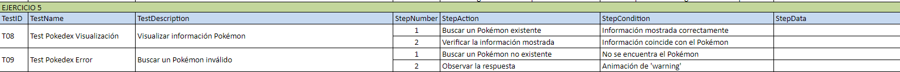

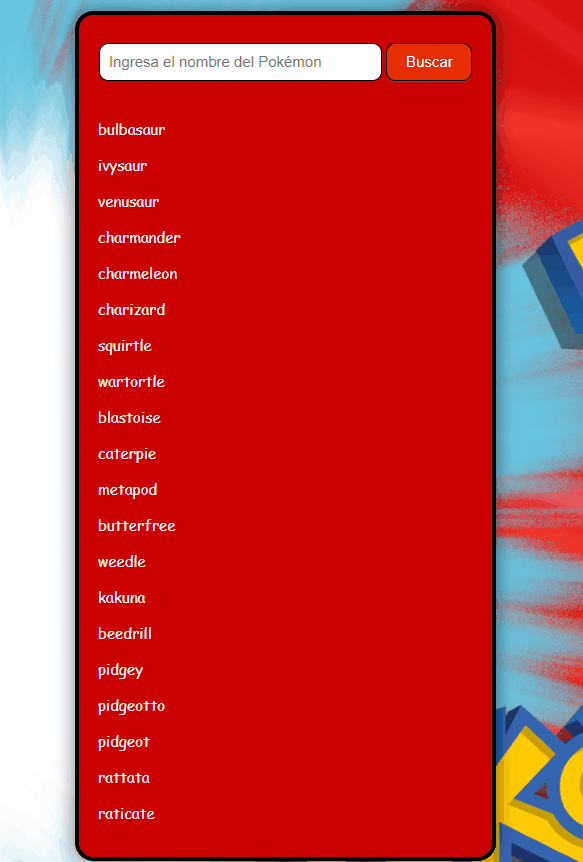