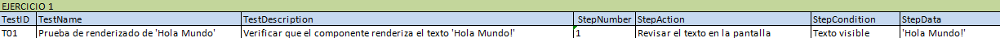
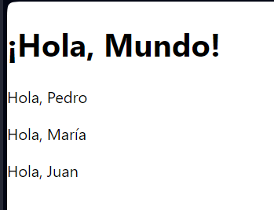
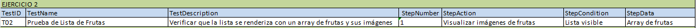
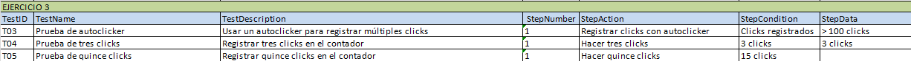
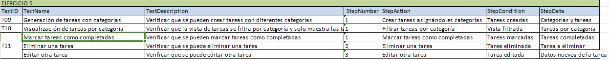
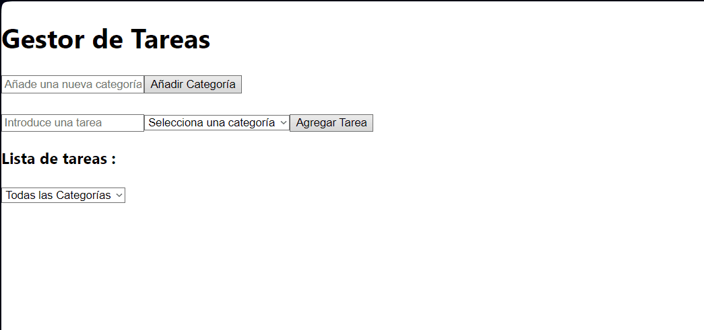

# 🔎 Análisis del problema

Hay que entregar una tarea que ha mandado el profesor a través de la plataforma classroom.

Estos ejercicios son para aprender a usar React.

La tarea consta de los siguientes ejercicios :

``` 
Ejercicio 1: Hola Mundo en React y Componente con Props

Tareas:

- Crea un componente funcional llamado HolaMundo que simplemente renderice un elemento <h1> con el texto "¡Hola, Mundo!".
Renderiza este componente dentro del componente App.

- Crea un componente funcional llamado Saludo que acepte una prop nombre. Este componente debe renderizar un párrafo que diga "Hola, [nombre]".

- Renderiza el componente Saludo varias veces en App con diferentes nombres.

Prueba: Hacer que ponga “Hola Mundo!”, ver que se renderiza y que el componente funcione como se pide en las Tareas.
```

```
Ejercicio 2: Lista de Elementos

Tareas:

- Crea un componente ListaDeFrutas que renderice una lista (<ul>) de elementos (<li>).

- El componente debe aceptar un array de frutas como prop y renderizar cada fruta en un elemento de lista. (renderizar su imagen)

- Prueba el componente con diferentes arrays de frutas.

Prueba: Hacer que aparezca la ListaDeFrutas y que se acepte un array de frutas y que se visualicen sus imágenes correspondientes. (5 tipos de frutas)
```

```
Ejercicio 3: Contador de Clicks

Tareas:

- Crea un componente Contador que muestre un número (inicialmente 0) y un botón.

- Cada vez que el botón sea clickeado, el número debe incrementarse en uno.

- Implementa esto utilizando el hook useState.

Prueba: Descargar un autoclicker y usarlo para que se registren muchos clicks para una de las pruebas. Otra prueba tiene que ser con tres clicks y otra con 15 clicks.
```

```
Ejercicio 4: Aplicación de Tareas

Tareas:

- Crea una aplicación de lista de tareas (ToDoApp) que permita al usuario añadir tareas, marcarlas como completadas y borrarlas.

- La aplicación debe tener un campo de texto para ingresar nuevas tareas y una lista de tareas mostradas debajo.

- Cada tarea en la lista debe tener un checkbox para marcarla como completada y un botón para eliminarla.

- Gestiona el estado de las tareas (añadir, completar, eliminar) utilizando useState.

Prueba: Haz una prueba para añadir un par de tareas, otra prueba para completar una tarea y otra prueba para eliminar la tarea restante.
```

```
Ejercicio 5: Gestor de Tareas con Estados Complejos y Local Storage

Objetivo: Desarrollar una aplicación de gestión de tareas (to-do list) avanzada en React que no solo permita añadir, marcar y eliminar tareas, sino también categorizarlas y persistir los datos en el navegador usando Local Storage.

Tareas:

- Diseña una interfaz que permita al usuario introducir tareas con una categoría asociada (por ejemplo, trabajo, personal, estudio).
Proporciona la opción de seleccionar categorías de una lista predefinida o añadir una nueva.

- Permite al usuario marcar tareas como completadas, editarlas o eliminarlas.

- Añade la funcionalidad para filtrar tareas por categoría o estado (completado, borrado).

- Uso de Local Storage para Persistencia de Datos

- Guarda las tareas y categorías en el Local Storage del navegador para que no se pierdan al recargar la página.

- Carga las tareas guardadas cuando la aplicación se inicia.

- Consejos: Manejo Complejo del Estado
Utiliza useState para manejar los diferentes estados de la aplicación (lista de tareas, categorías, filtro seleccionado).
Considera la utilización de useReducer si el manejo del estado se vuelve demasiado complejo con useState.

- Prueba: Genera tareas con diversas categorías. Muestra la vista filtrada de cada categoría donde sólo aparezcan esas tareas. Marca algunas como completadas, elimina una y edita otra.Recarga la página y vuelve a mirar si están las tareas guardadas o no (deberían estar).
``` 
Formato de entrega

Todos estos ejercicios se deberán entregar en el formato establecido en clase o tablón de classroom, respetando las horas de entrega de cada uno de ellos indicados en la tarea de classroom.

¿Qué y cómo se entrega?

Hay que realizar cada apartado de ejercicios en una carpeta diferente siendo cada una de estas un proyecto react con la solución al ejercicio.

Hay que realizar un vídeo en formato .gif para cada ejercicio en el que se interactúe de manera dinámica con la web y adjuntarlo en el README.md del repositorio GIT en la carpeta del sprint correspondiente.

Hay que realizar una captura de pantalla de aquellos ejercicios que sean estáticos y adjuntarlos en el README.md del repositorio GIT en la carpeta del sprint correspondiente.

# 📝 Diseño de la solución

Para entregar la tarea correctamente habrá que seguir el formato de entrega indicado en la misma. Posteriormente, habrá que leer cada apartado para saber lo que se pide y con ayuda de ChatGPT y mia, resolverlos.

# 💉  Implementación de la solución.

## Ejercicio 1: Hola Mundo en React y Componente con Props

[**EJERCICIO 1** ](ejercicio1/src)

## Ejercicio 2: Lista de Elementos

[**EJERCICIO 2** ](ejercicio2/src)

## Ejercicio 3: Contador de Clicks

[**EJERCICIO 3** ](ejercicio3/src)

## Ejercicio 4: Aplicación de Tareas

[**EJERCICIO 4** ](ejercicio4/src)

## Ejercicio 5: Gestor de Tareas con Estados Complejos y Local Storage

[**EJERCICIO 5** ](ejercicio5/src)

# 📸 Pruebas

## Ejercicio 1: Hola Mundo en React y Componente con Props





## Ejercicio 2: Lista de Elementos




## Ejercicio 3: Contador de Clicks



.gif)

.gif)

## Ejercicio 4: Aplicación de Tareas


.gif)

.gif)

## Ejercicio 5: Gestor de Tareas con Estados Complejos y Local Storage




.gif)
.gif)
.gif)
