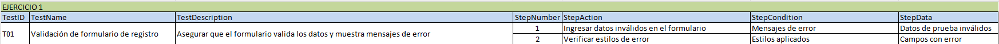
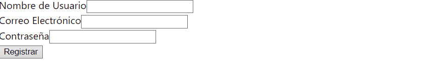
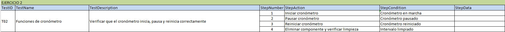
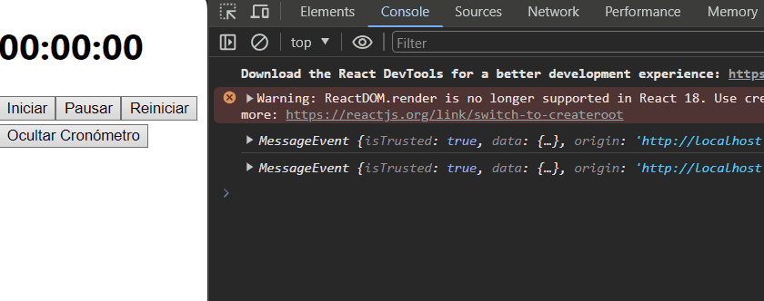
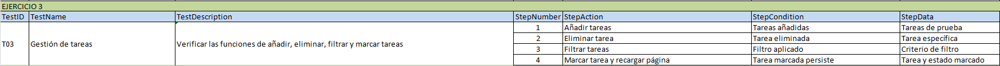
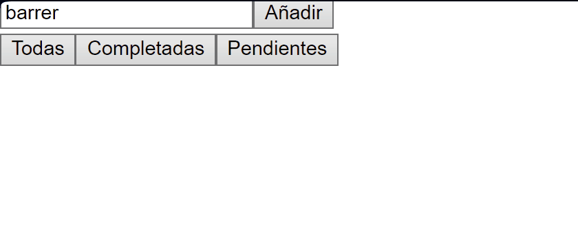
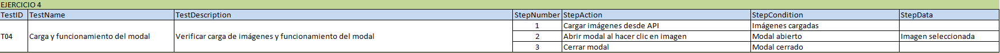
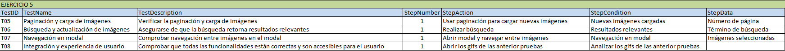

# 🔎 Análisis del problema

Hay que entregar una tarea que ha mandado el profesor a través de la plataforma classroom.

Estos ejercicios son para aprender a usar React.

La tarea consta de los siguientes ejercicios :

``` 
Ejercicio 1: Formulario de Registro con Validación

Objetivo: Crear un componente de clase `FormularioRegistro` que incluya campos para el
nombre de usuario, correo electrónico y contraseña, con validación de cada campo. Tareas:

1. Crea un componente de clase `FormularioRegistro` con un estado que contenga
valores para nombre de usuario, correo electrónico, contraseña y mensajes de error
para cada campo.

2. Agrega métodos para manejar los cambios en cada campo del formulario y validar
los datos ingresados (por ejemplo, verificar que el correo tenga un formato válido).

3. El método `render` debe mostrar un formulario con campos para el nombre de
usuario, correo electrónico, contraseña y mensajes de error correspondientes.

4. Implementa estilos condicionales para mostrar los campos de texto en rojo si hay un
error de validación.

5. Renderiza `FormularioRegistro` en `App` y prueba la validación del formulario.

Prueba: Asegúrate de que el formulario valida correctamente los datos y muestra mensajes
de error. Verifica que los estilos de error se aplican correctamente a los campos inválidos.
```

```
Ejercicio 2: Cronómetro con Inicio, Pausa y Reinicio

Objetivo: Crear un componente de clase `Cronometro` que funcione como un cronómetro
con botones para iniciar, pausar y reiniciar el tiempo. Tareas:

1. Crea un componente de clase `Cronometro` con un estado que incluya el tiempo
transcurrido y si el cronómetro está activo o no.

2. Implementa un método para iniciar el cronómetro que use `setInterval` para
actualizar el tiempo cada segundo.

3. Agrega métodos para pausar y reiniciar el cronómetro, actualizando el estado según
corresponda.

4. El método `componentWillUnmount` debe limpiar el intervalo para evitar fugas de
memoria.

5. El método `render` debe mostrar el tiempo transcurrido y botones para iniciar, pausar
y reiniciar el cronómetro.

6. Renderiza `Cronometro` en `App` y prueba su funcionalidad.

Prueba: Verifica que el cronómetro inicia, pausa y se reinicia correctamente. Comprueba que
al eliminar el componente del DOM, el intervalo se limpia para evitar fugas de memoria.
```

```
Ejercicio 3: Aplicación de Tareas con Filtrado y Almacenamiento Local

Objetivo: Crear una aplicación de tareas (`AppTareas`) que permita añadir, eliminar, filtrar
tareas y almacenarlas en el almacenamiento local del navegador. Tareas:

1. Crea un componente de clase `AppTareas` con un estado que incluya un arreglo de
tareas, un campo de texto para nuevas tareas y un filtro de estado (todas,
completadas, pendientes).

2. Implementa funcionalidades para añadir nuevas tareas, marcarlas como
completadas, eliminar tareas y filtrarlas según su estado.

3. Usa `componentDidMount` para cargar las tareas almacenadas en el
almacenamiento local y `componentDidUpdate` para actualizar el almacenamiento
local cuando las tareas cambien.

4. El método `render` debe mostrar un formulario para nuevas tareas, botones para
filtrar, y una lista de tareas que refleje el filtro seleccionado.

5. Renderiza `AppTareas` en `App` y prueba todas las funcionalidades.
Prueba: Asegúrate de que la aplicación permite añadir, eliminar, filtrar y marcar tareas.
Verifica que las tareas persisten al recargar la página.
```

```
Ejercicio 4: Galería de Imágenes con Carga Asíncrona y Modal

Objetivo: Crear una galería de imágenes (`GaleriaImagenes`) que cargue imágenes de una
API, las muestre en un grid y permita abrir una imagen en un modal al hacer clic. Tareas:

1. Crea un componente de clase `GaleriaImagenes` con un estado que incluya un
arreglo de imágenes y la imagen seleccionada para el modal.

2. En `componentDidMount`, realiza una petición a una API de imágenes (como
Unsplash o similar) para cargar imágenes y guardarlas en el estado.

3. Implementa un componente modal que se abra al hacer clic en una imagen,
mostrando la imagen en tamaño completo.

4. El método `render` debe mostrar un grid de imágenes y, si una imagen está
seleccionada, el modal con la imagen.

5. Renderiza `GaleriaImagenes` en `App` y prueba la carga de imágenes y la
funcionalidad del modal.

Prueba: Verifica que las imágenes se cargan correctamente desde la API y que el modal
funciona al hacer clic en las imágenes. Asegúrate de que el modal se cierra adecuadamente.
```

```
Ejercicio 5: Galería de Imágenes con Carga Asíncrona, Modal y Funcionalidades Avanzadas

Objetivo: Crear una galería de imágenes avanzada (GaleriaImagenesAvanzada) que cargue
imágenes de una API, las muestre en un grid, permita abrir una imagen en un modal, y
ofrezca funcionalidades adicionales como búsqueda y paginación. 

Tareas:

Componente de Clase GaleriaImagenesAvanzada: Crea un componente con un estado que
incluya un arreglo de imágenes, la imagen seleccionada para el modal, la página actual y
términos de búsqueda.

Carga Asíncrona de Imágenes:

● En componentDidMount, realiza una petición a una API de imágenes (como
Unsplash) para cargar imágenes y guardarlas en el estado.

● Implementa la paginación para cargar más imágenes cuando el usuario llegue al
final del grid o mediante botones de navegación.

Búsqueda de Imágenes:

● Añade un campo de búsqueda para permitir a los usuarios buscar imágenes por
términos específicos.

● Actualiza la galería de acuerdo a los resultados de la búsqueda.
Componente Modal para Visualización de Imágenes:

● Implementa un componente modal que se abra al hacer clic en una imagen,
mostrando la imagen en tamaño completo.

● Añade funcionalidades al modal, como botones para navegar entre imágenes en la
galería.
Renderizado y Prueba:

● El método render debe mostrar un campo de búsqueda, un grid de imágenes,
controles de paginación y, si una imagen está seleccionada, el modal con la imagen.

● Renderiza GaleriaImagenesAvanzada en App y prueba la carga de imágenes, la
funcionalidad del modal, la búsqueda y la paginación.
Prueba:

● Verifica que las imágenes se cargan correctamente desde la API y que la paginación
funciona adecuadamente.

● Asegúrate de que la búsqueda retorna resultados relevantes y actualiza el grid de
imágenes.

● Comprueba que el modal se abre al hacer clic en las imágenes y permite navegar
entre ellas.

● Confirma que todas las funcionalidades se integran armoniosamente y ofrecen una
experiencia de usuario fluida
``` 
Formato de entrega

Todos estos ejercicios se deberán entregar en el formato establecido en clase o tablón de classroom, respetando las horas de entrega de cada uno de ellos indicados en la tarea de classroom.

¿Qué y cómo se entrega?

Hay que realizar cada apartado de ejercicios en una carpeta diferente siendo cada una de estas un proyecto react con la solución al ejercicio.

Hay que realizar un vídeo en formato .gif para cada ejercicio en el que se interactúe de manera dinámica con la web y adjuntarlo en el README.md del repositorio GIT en la carpeta del sprint correspondiente.

Hay que realizar una captura de pantalla de aquellos ejercicios que sean estáticos y adjuntarlos en el README.md del repositorio GIT en la carpeta del sprint correspondiente.

# 📝 Diseño de la solución

Para entregar la tarea correctamente habrá que seguir el formato de entrega indicado en la misma. Posteriormente, habrá que leer cada apartado para saber lo que se pide y con ayuda de ChatGPT y mia, resolverlos.

# 💉  Implementación de la solución.

## Ejercicio 1: Formulario de Registro con Validación

[**EJERCICIO 1** ](ejercicio1/src)

## Ejercicio 2: Cronómetro con Inicio, Pausa y Reinicio

[**EJERCICIO 2** ](ejercicio2/src)

## Ejercicio 3: Aplicación de Tareas con Filtrado y Almacenamiento Local

[**EJERCICIO 3** ](ejercicio3/src)

## Ejercicio 4: Galería de Imágenes con Carga Asíncrona y Modal

[**EJERCICIO 4** ](ejercicio4/src)

## Ejercicio 5: Galería de Imágenes con Carga Asíncrona, Modal y Funcionalidades Avanzadas

[**EJERCICIO 5** ](ejercicio5/src)

# 📸 Pruebas

## Ejercicio 1: Formulario de Registro con Validación





## Ejercicio 2: Cronómetro con Inicio, Pausa y Reinicio





## Ejercicio 3: Aplicación de Tareas con Filtrado y Almacenamiento Local






## Ejercicio 4: Galería de Imágenes con Carga Asíncrona y Modal




## Ejercicio 5: Galería de Imágenes con Carga Asíncrona, Modal y Funcionalidades Avanzadas



.gif)

.gif)

.gif)