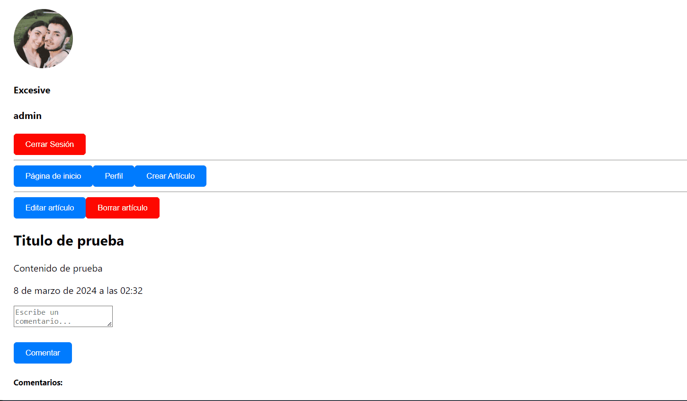
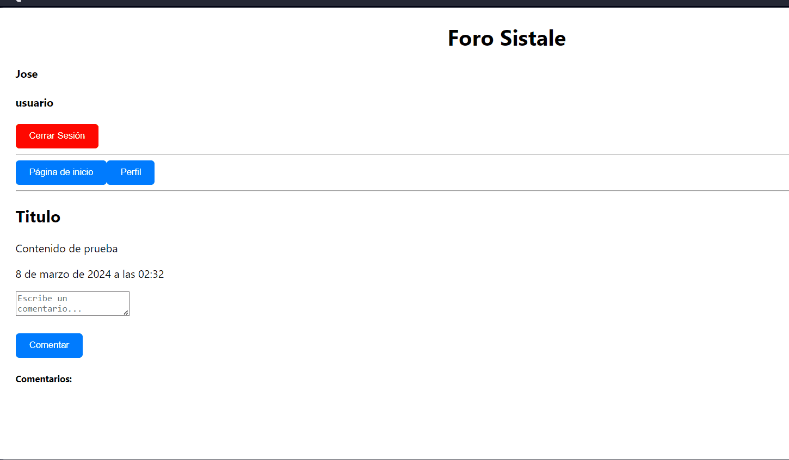

# 🔎 Análisis del problema

Hay que entregar una tarea final que ha mandado el profesor que será subida a Github y compartida a través de la plataforma 
classroom.

Este ejercicio es para poner en práctica todo lo aprendido en React entre otras muchas cosas más.

Mi tarea final consistirá en lo siguiente :

``` 
Foros y wikis - Sistemas de comentarios, edición de artículos con sistemas de permisos

Objetivo: Implementar un sistema `ForoWiki` que permita la edición de artículos y gestión de comentarios con sistemas de permisos.

Tareas:

Desarrolla un modelo para los artículos y comentarios, incluyendo información sobre los autores y permisos.

Crea el componente `ForoWiki` con un estado que maneje artículos, comentarios y permisos de usuarios.

Agrega métodos para añadir y editar artículos, publicar comentarios y gestionar permisos de edición basados en roles de usuario.

El método `render` debe permitir la visualización de artículos, la edición (para usuarios con permisos) y la publicación de comentarios.

Implementa una lógica de permisos que restrinja la edición de artículos y comentarios a usuarios autorizados.

Renderiza `ForoWiki` en `App` y prueba la edición de artículos, gestión de comentarios y sistemas de permisos.

Prueba: Asegúrate de que la edición de artículos y la publicación de comentarios funcionan correctamente, respetando los sistemas de permisos establecidos.

¿Qué se entrega?
GIFs donde se muestren la edición de artículos y los comentarios. También el cómo interactúan los diferentes permisos de usuario, siendo mínimo administradores, moderadores y usuarios básicos.
```

## Formato de entrega

Todos estos ejercicios se deberán entregar en el formato establecido en clase o 
tablón de classroom, respetando las horas de entrega de cada uno de ellos indicados
 en la tarea de classroom.

¿Qué y cómo se entrega?

Hay que realizar cada apartado de ejercicios en una carpeta diferente siendo cada 
una de estas un proyecto react con la solución al ejercicio.

Hay que realizar un vídeo en formato .gif para cada ejercicio en el que se 
interactúe de manera dinámica con la web y adjuntarlo en el README.md del 
repositorio GIT en la carpeta del sprint correspondiente.

Hay que realizar una captura de pantalla de aquellos ejercicios que sean estáticos
y adjuntarlos en el README.md del repositorio GIT en la carpeta del sprint correspondiente.

# 📝 Diseño de la solución

Para entregar la tarea final correctamente habrá que seguir el formato de entrega 
indicado en la misma. Posteriormente, habrá que leer el apartado para saber 
lo que se pide y con ayuda de ChatGPT y mia, resolverlos.

# 💉  Implementación de la solución.

## Ejercicio Final : Foros y wikis - Sistemas de comentarios, edición de artículos con sistemas de permisos

[**EJERCICIO FINAL** ](src/)

# 📸 Pruebas







